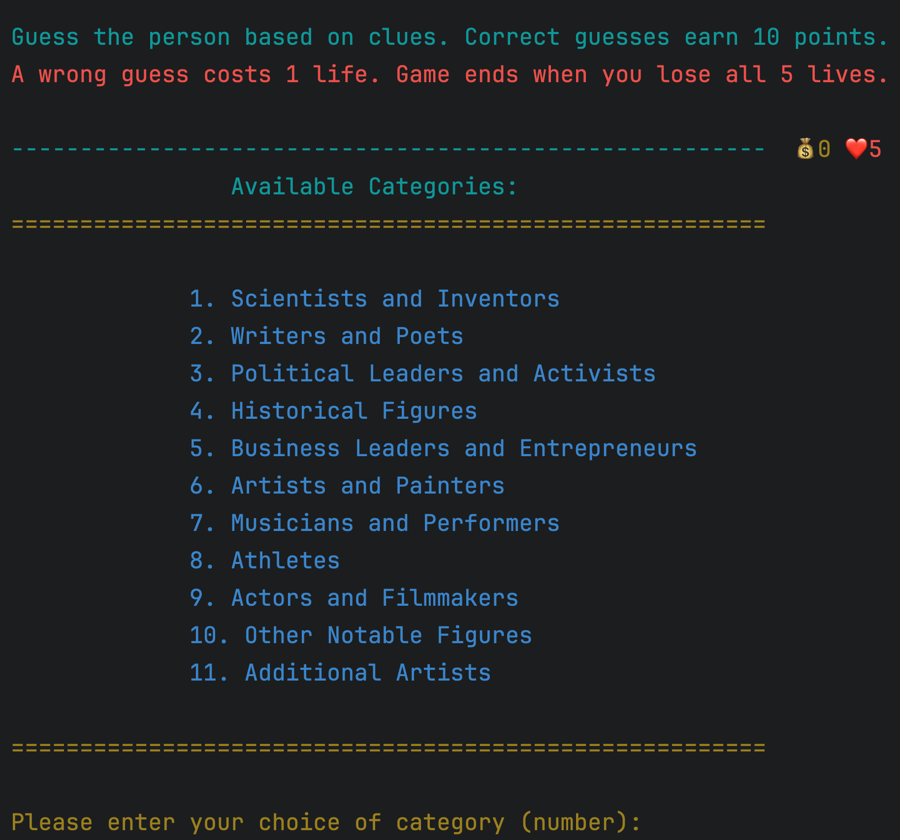

# wikiWho? - A Python Game Using Wikipedia Data

**wikiWho?** is a fun and educational Python-based guessing game. Players attempt to identify famous individuals based on dynamically fetched clues from Wikipedia summaries. The game includes scoring, a lives system, sanitized clues, and multiple rounds.

## 🎮 Game Features

- **Objective**: Guess a famous person using sanitized clues derived from Wikipedia.
- **Dynamic Gameplay**: Fetches real-time summaries to generate clues for players.
- **Lives System**: Players start with 5 lives; each incorrect guess deducts a life.
- **Scoring**: Correct answers earn points, while wrong guesses cost lives.
- **Rounds**: Continue playing until you lose all lives.
- **Replay Option**: Restart the game upon completion.

## Available Categories

## 🕹️ Gameplay

1. Players are presented with clues about a famous person (excluding the name).
2. Choose the correct person from five options: A, B, C, D, or E.
3. Accumulate points for correct guesses.
4. The game ends when all lives are lost.

  

 

## 📚 Scoring and Lives

- **Points**: Earn 10 points for each correct answer.
- **Lives**: Lose 1 life for every incorrect guess. Game ends at 0 lives.

## 🛠️ Setup

### Prerequisites

Ensure you have Python 3 installed on your machine.

